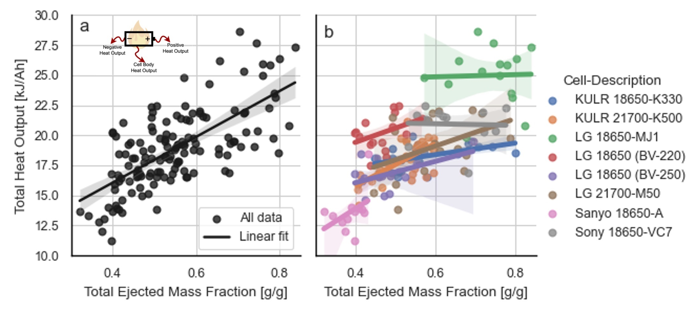
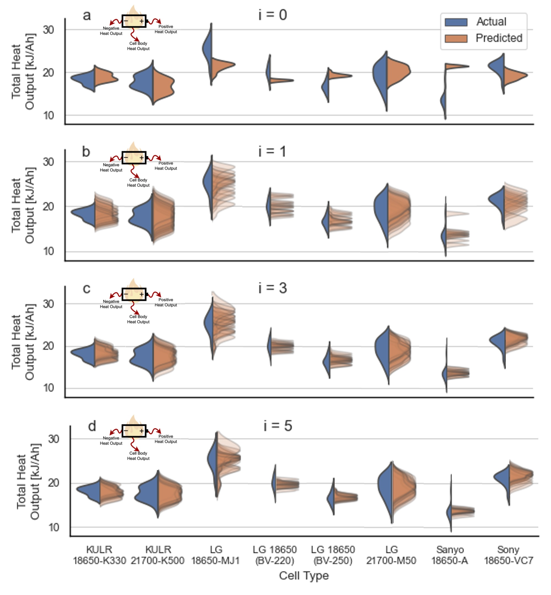

# battery-heat-output
Leveraging the 'Battery Failure Databank' published by NREL and NASA, uses machine-learning to predict fractional heat output during thermal runaway from cell metadata and measured ejected and remaining cell mass after a thermal runaway event. Fractional heat output, i.e., heat output from the cell body, from ejecta released out of the positive tab, and from ejecta released out of the negative tab, was measured using a fractional thermal runaway calorimeter. Cell metadata and ejected/remaining cell mass can be measured using substantially cheaper methods, enabling cheaper and faster estimation of thermal runaway risk.

## Repository structure
- 'data' folder contains a copy of the battery failure databank (version 2)
- 'src' folder contains classes and methods for data processing, model definitions and training, and analysis tools for plotting results
- `main.py` trains models and saves resulting predictions and errors into json files
- 'Plots.ipynb' creates plots of the data and results, as shown in the manuscript

## Installation
Setup a virtual environment using conda with the 'environment.yml' file.

## Battery Failure Databank 
For this work, 139 measurements from the Battery Failure Databank are utilized, predicting heat output from ejected mass data. Overall, these two measurements are storngly correlated, however there is substantial variability in the behavior observed across different cell types, for example, the KULR 18650-K330 cells show a clear relationship, while the LG 18650-MJ1 cells have no correlation between heat ouput and ejected mass.

The distributions of heat output from each cell type are predicted using a machine-learning model. 'Zero-shot' predictions, made using zero heat output measurements for the cell type being tested, are successful for some cells. 'i-shot' predictions, where some number of heat output measurements 'i' are used to calibrate the model to the new cell type, show that the entire distribution of heat outputs (heat output from up to 30 cells, for this data set) can be predicted accurately with just 1-5 heat output measurements.

## Authors
Karina Masalkovaite, Paul Gasper, Donal Finegan

National Renewable Energy Lab, Denver, CO, USA

Contact: Paul.Gasper@nrel.gov, Donal.Finegan@nrel.gov
